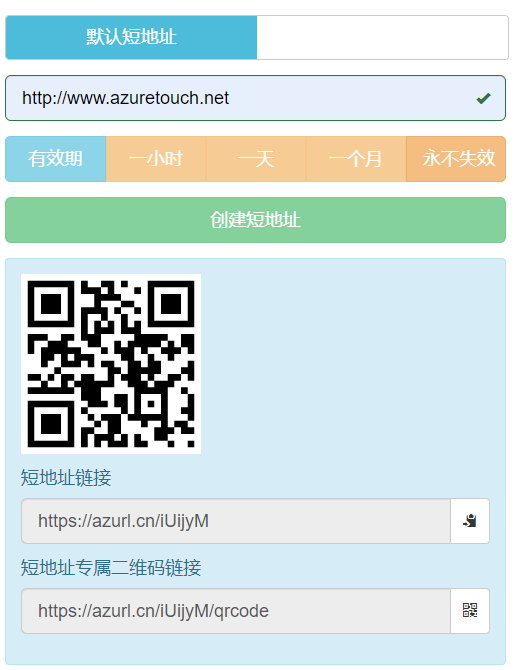

# 蔚蓝短地址(https://azurl.cn)

## 使用帮助

#### 创建标准的短地址

> 蔚蓝短地址的示例：https://azurl.cn/xxxxxx

你可以填入你所需要缩短的地址，然后点击创建，就可以获得对应的短地址，及二维码

#### 创建自定义短地址

> 你必须登录以后，才可以使用自定义短地址。

你可以填入你自己想要的短地址后缀，后缀长度在2~25个字符，并支持中文。
之后，按照创建标准短地址的步骤，即可获得对应的短地址和二维码

#### 使用短地址的有效期

> 你必须登录以后，才可以使用有效期功能。
> 默认有效期为永久有效。

当你想在某段时间以后短地址不可使用，就可以使用此功能。
有效期分 1小时，1天，1月和永久。

#### 短地址的二维码

每个短地址都可以生成特有的二维码图片。
二维码图片的链接，就是你的短地址 + "/qrcode"，例如 https://azurl.cn/xxxxxx/qrcode。

