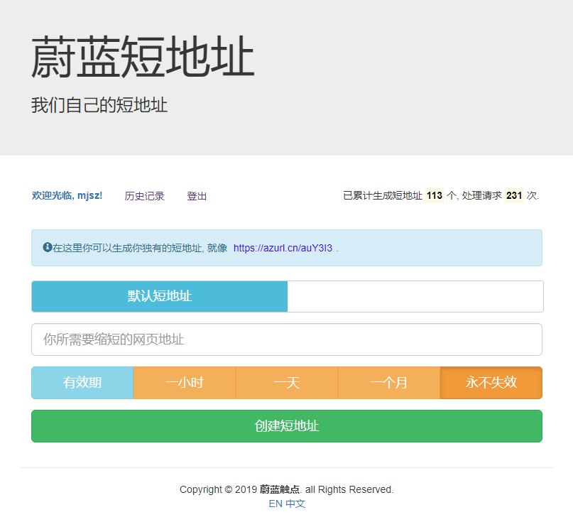
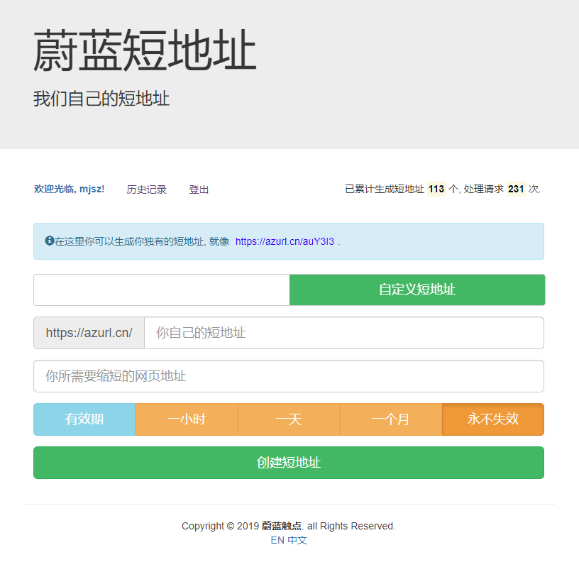

# 蔚蓝短地址(https://azurl.cn)

由于业务需求，开发了这样一个短地址的网站，以便内部业务可以使用。

和 t.cn 一样，用户可以生成类似于 azurl.cn/xxxxxx 这样的短地址。

## 网站截图

## 功能

- [x] [创建标准短地址(例:https://azurl.cn/auY3I3)]
- [x] [创建自定义短地址(例:https://azurl.cn/azurl)]

## 参与者

### 开发

- [mjsz](https://blog.azpro.cn/)
